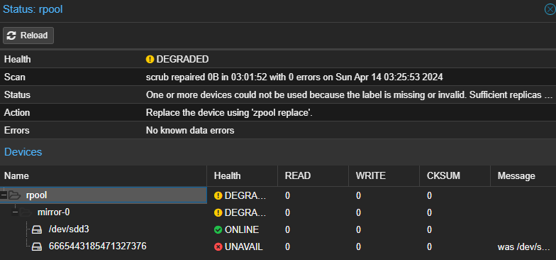
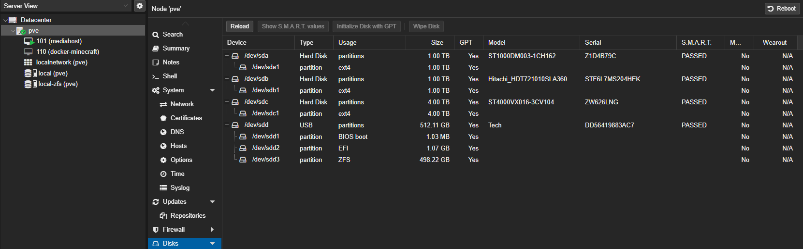
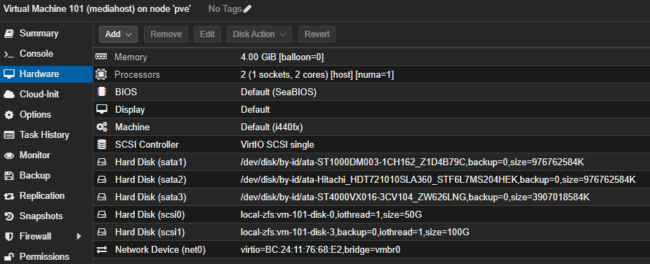

## Host specs

- 8 x Intel i7-6700 CPU @ 3.40GHz (1 Socket)
- 32GB DDR4 RAM @2333MhZ
- Disks see below

# Installating proxmox

- Download ISO Proxmox Virtual Environment 8.1.3
- UEFI Boot from USB Stick with ISO
- Follow install instructions, name it "pve"
- Create ZFS Raid0 (originally two disks, 1x ssd 500gb + 1x sshd 500gb) // 20.07.24: removed the sshd due too many smart errors
  
- Create Backup Policy
  
- Attach disks to sata
  
- Create a bridge

## Tuning

We're on intel, so we can clock down the cpu if not needed, for that add an crontab to persist following changes

```bash
# set power profile on reboot
@reboot echo "powersave" | tee /sys/devices/system/cpu/cpu*/cpufreq/scaling_governor >/dev/null 2>&1
```

Other useful tools: <br/>
`apt install powertop iotop`

## Removing subscription warning

Every time you login into the Proxmox VE web console, you are met with the following warning.

Proxmox VE subscription warning

This is bothersome, but has an easy solution.

Open a root shell and execute the next cd command.

`cd /usr/share/javascript/proxmox-widget-toolkit`

In that proxmox-widget-toolkit directory there's a javascript library file called proxmoxlib.js. Make a backup of it.

`cp proxmoxlib.js proxmoxlib.js.orig`

Open the proxmoxlib.js file with a proper text editor (vi, vim or nano). Then, in the javascript code, search for the following text.

```js
Ext.Msg.show({
  title: gettext('No valid subscription'),
```

When you locate it (just search the No valid subscription string, its unique in the code), replace Ext.Msg.show with void, as shown below.

```js
void({ //Ext.Msg.show({
  title: gettext('No valid subscription'),
```

Save the change and exit the editor, then restart the Proxmox web service.
`systemctl restart pveproxy.service`

## Disk overview

There's a zfs pool with 500 GB storage which was created during proxmox installation
This pool holds all VM Disks

Initially two "OS-Disks" were created `50`GB each. <br/>
There is another added "Usenet-Downloads-Disk" `100`GB also residing in the pool

All other disks are passed through on the vm "mediahost" as sata

## Passthrough disks to VMs

show block devices <br/>
`lsblk`

show block devices with partitions<br/>
`blkid`

or my favorite command <br/>
`ls -n /dev/disk/by-id`

now to bind it to a vm we use this syntax <br/>
`/sbin/qm set <vm-id> <adapter-id> <path-to-disk-by-id>`

__e.g.__ <br/>
`/sbin/qm set 101 -sata3 /dev/disk/by-id/ata-ST4000VX016-3CV104_ZW626LNG`

### Good to know:

- be careful as `set` overwrites disk assignment
- make sure to set `backup=0`
- use virtio`number` to attach it in order if needed
- one can check the assignment on `vm -> hardware`


<br/>
<br/>

[Jump to parent file](README.md)
