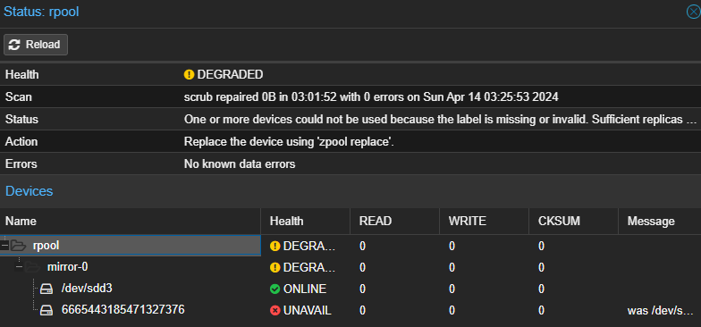
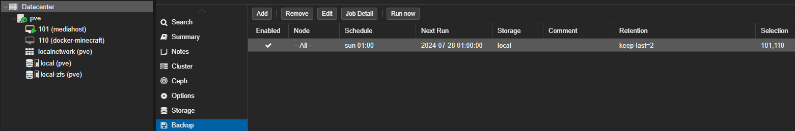
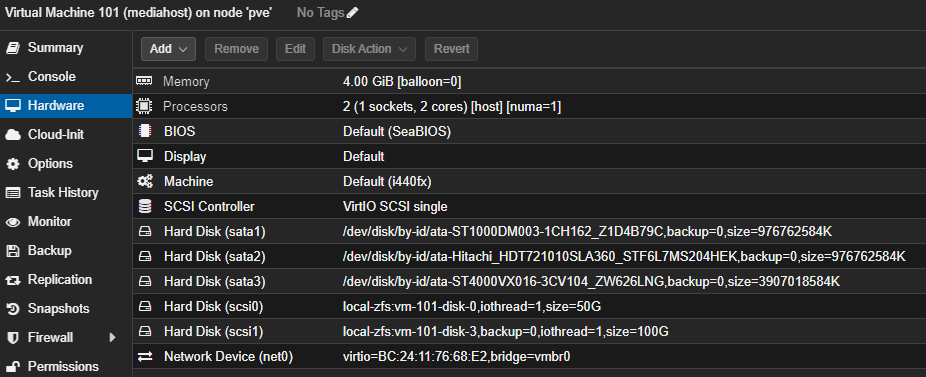

# Overview
This document shows the setup of our complete mediaserver - this is not a beginner tutorial, just a mockup for owners to remember made steps

## Host specs
- 8 x Intel i7-6700 CPU @ 3.40GHz (1 Socket)
- 32GB DDR4 RAM @2333MhZ
- Disks see below

## Installating proxmox
- Download ISO Proxmox Virtual Environment 8.1.3
- UEFI Boot from USB Stick with ISO
- Follow install instructions, name it "pve"
- Create ZFS Raid0 (originally two disks, 1x ssd 500gb + 1x sshd 500gb) // 20.07.24: removed the sshd due too many smart errors
  
- Create Backup Policy
  
- Attach disks to sata
  
- Create a bridge 

### Tuning
We're on intel, so we can clock down the cpu if not needed, for that add an crontab to persist following changes

```
# set power profile on reboot
@reboot echo "powersave" | tee /sys/devices/system/cpu/cpu*/cpufreq/scaling_governor >/dev/null 2>&1
```

Other useful tools: <br/>
`apt install powertop iotop`


### Removing subscription warning
Every time you login into the Proxmox VE web console, you are met with the following warning.

Proxmox VE subscription warning

This is bothersome, but has an easy solution.

Open a root shell and execute the next cd command.

`cd /usr/share/javascript/proxmox-widget-toolkit`

In that proxmox-widget-toolkit directory there's a javascript library file called proxmoxlib.js. Make a backup of it.

`cp proxmoxlib.js proxmoxlib.js.orig`

Open the proxmoxlib.js file with a proper text editor (vi, vim or nano). Then, in the javascript code, search for the following text.
```
Ext.Msg.show({
  title: gettext('No valid subscription'),
```

When you locate it (just search the No valid subscription string, its unique in the code), replace Ext.Msg.show with void, as shown below.
```
void({ //Ext.Msg.show({
  title: gettext('No valid subscription'),
```

Save the change and exit the editor, then restart the Proxmox web service.
`systemctl restart pveproxy.service`

### Disk overview
There's a zfs pool with 500 GB storage which was created during proxmox installation
This pool holds all VM Disks

Initially two "OS-Disks" were created `50`GB each. <br/>
There is another added "Usenet-Downloads-Disk" `100`GB also residing in the pool

All other disks are passed through on the vm "mediahost" as sata

### Passthrough disks to VMs

show block devices <br/>
`lsblk`

show block devices with partitions<br/>
`blkid`

or my favorite command <br/>
`ls -n /dev/disk/by-id`

now to bind it to a vm we use this syntax <br/>
`/sbin/qm set <vm-id> <adapter-id> <path-to-disk-by-id>`

__e.g.__ <br/>
`/sbin/qm set 101 -sata3 /dev/disk/by-id/ata-ST4000VX016-3CV104_ZW626LNG`

#### Good to know:
- be careful as `set` overwrites disk assignment
- make sure to set `backup=0`
- use virtio<number> to attach it in order if needed
- one can check the assignment on `vm -> hardware`



## Configuration `mediahost` VM
vmid `101`
The VM holds two users, `root`(0) and `redacted`(1000)<br/>

I usually work with root because I'm an admin and accept the "security risks" <br/>
=> this is why there's never `sudo` before any command

The VM uses my custom [aliases](aliases.md)

## SSH 
Create an SSH key in PuttyKeyGen and save it to your computer/private cloud

On the VM goto `/root/.ssh/authorized_keys` and paste the public key in, expanding the file

Setup Putty to connect to the ip and use your private key as auth

### Edit the ssh config file
`nano /etc/ssh/sshd_config` and make sure `PermitRootLogin prohibit-password` is set

## Install and Configure Docker
https://docs.docker.com/engine/install/ubuntu/

Create an folder 
we are admins, so we work as root - use of other users belonging to the sudoer-group should work, too

mkdir `/docker`

create folders using this structure
```
/docker/service1
  /docker/service1/config
  /docker/service1/data
  /docker/service1/db_data
  /docker/service1/docker-compose.yaml
/docker/service2
  /docker/service2/config
  /docker/service2/docker-compose.yaml
```

in the `docker-compose.yaml`you can reference those folders using relative paths like
```
    volumes:
      - './data:/data'
```

### Install MergeFS
Update Repository Cache <br/>
`apt update -y`

Install with <br/>
`apt install -y mergerfs`

Reboot <br/>
`reboot`

Create new folders with recommended settings using disks which are defined beforehand (see above)
```
# MergerFS to show all systems 1 disk at all times no matter what lies below it || https://github.com/trapexit/mergerfs
# Movies
/mnt/movies-disk1:/mnt/movies-disk2 /data/movies mergerfs defaults,nonempty,allow_other,category.create=mfs,use_ino,cache.files=auto-full,moveonenospc=true,dropcacheonclose=true 0 0
# Series
/mnt/series-disk1 /data/series mergerfs defaults,nonempty,allow_other,category.create=mfs,use_ino,cache.files=auto-full,moveonenospc=true,dropcacheonclose=true 0 0
```

### Disks
use same commands as before to determine disks with ids and place it in `/etc/fstab`

for our usecase we assume the folder `/data` was created and is accessible

```
# SERIES HDD PASSTHROUGH (4TB Seagate 07/2024)
UUID=5c34014d-50f6-4070-b1c4-673c8d86791e /mnt/series-disk1 auto nosuid,nodev,nofail,x-gvfs-show 0 0

# MOVIES HDD PASSTROUGH (1TB Seagate ??/????)
UUID=0b77fe0a-e6c3-49a1-bca3-b30ed7039a08 /mnt/movies-disk1 auto nosuid,nodev,nofail,x-gvfs-show 0 0

# MOVIES HDD PASSTROUGH (1TB Hitachi ??/????)
UUID=13318462-ba16-40b2-9a7b-fc54da4f33c7 /mnt/movies-disk2 auto nosuid,nodev,nofail,x-gvfs-show 0 0

# USENET SSD RAID10 ZFS from Host
UUID=79406f2b-cfc5-43f9-a030-23733424e86d /data/usenet auto nosuid,nodev,nofail,x-gvfs-show 0 0
```

### Increase disksize

First: goto proxmox and verify the free space at the zfs pool or storage block <br/>
then increase the vm disk size under hardware -> disk action -> increase size -> increment in GB

hit apply and reboot vm <br/>
in the ubuntu vm use `parted`

see below for examples:
```
parted

(parted) print
Model: QEMU QEMU HARDDISK (scsi)
Disk /dev/sda: 53,7GB
Sector size (logical/physical): 512B/512B
Partition Table: gpt
Disk Flags:

Number  Start   End     Size    File system  Name  Flags
 1      1049kB  2097kB  1049kB                     bios_grub
 2      2097kB  50,0MB  47,9MB  ext4

(parted) resizepart
Partition number? 2
Warning: Partition /dev/sda2 is being used. Are you sure you want to continue?
Yes/No? Yes
End?  [50,0MB]? 50GB
(parted) print
Model: QEMU QEMU HARDDISK (scsi)
Disk /dev/sda: 53,7GB
Sector size (logical/physical): 512B/512B
Partition Table: gpt
Disk Flags:

Number  Start   End     Size    File system  Name  Flags
 1      1049kB  2097kB  1049kB                     bios_grub
 2      2097kB  50,0GB  50,0GB  ext4

(parted)

Information: You may need to update /etc/fstab.
```

then extend it finally <br/>
`resize2fs /dev/sda2`

<br/>

## Roadmap

- Documentation for Plex
- Documentation for Arr-Suite
- Documentation Kometa
- Documentation Downloader with VPN and Indexer


## Powerusers

[@lucaz82](https://www.github.com/lucaz82) <br/>
[@MKr4zy](https://www.github.com/MKr4zy)
